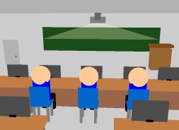
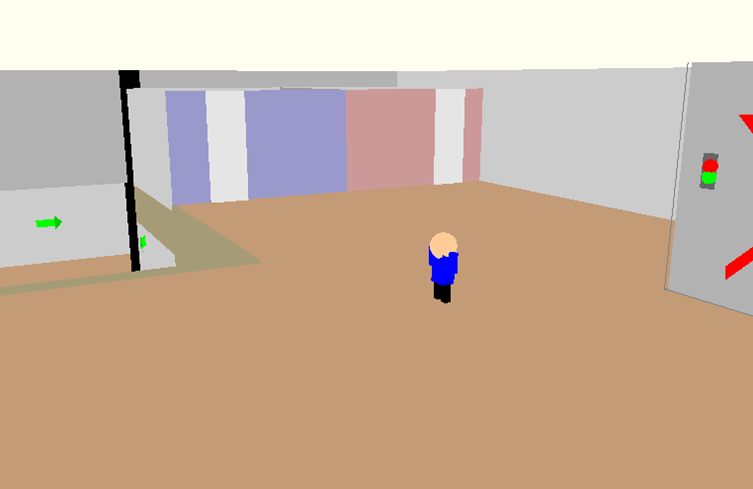
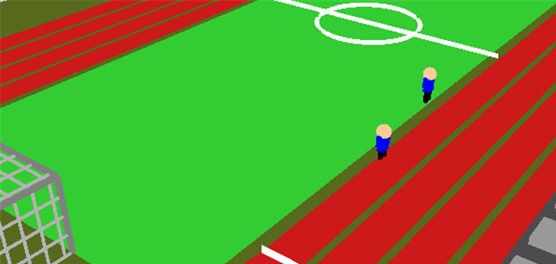

# OpenGL 지진 대피 시뮬레이션

학교 건물을 3D로 만들고, 1인칭으로 교실에서 복도를 거쳐 운동장까지 대피해 보는 시뮬레이터입니다.
컴퓨터그래픽스 학기 프로젝트로 만들었습니다.

<p>
  
  
  
  
  
  <a href="https://www.notion.so/3D-e7aa1e73062e477ba05e0971de5bef18?source=copy_link"></a>
</p>

<p></p>

<br/>

## 1. 왜 만들었나

지진 대피 훈련은 보통 방송 한 번 나오고 줄 서서 나가는 걸로 끝납니다.
어디로 가야 하는지, 어느 길이 막히는지는 겪어 보지 않으면 모릅니다.

직접 걸어서 나가 보게 만들면 기억에 남지 않을까 해서 시작했습니다.

<br/>

## 2. 건물을 전부 직접 그렸다

모델 파일을 불러오지 않았습니다. OpenGL 고정 파이프라인 프리미티브로 하나씩 쌓았습니다.
`src/main.cpp` 한 파일에 2,047줄, 함수 56개가 들어 있습니다.

**1층**

| 함수 | 그리는 것 |
|---|---|
| `drawClassroom1F` `drawClassroomSetupWithChairs1F` | 1층 교실과 책걸상 배치 |
| `drawPodium` `drawBlackboard` `drawDesk` `drawChairs` | 교탁, 칠판, 책상, 의자 |
| `drawProjector` `drawMonitors` | 빔프로젝터, 모니터 |
| `draw1FWalls` `drawGlassDoorLeft` `drawGlassDoorRight` | 벽과 현관 유리문 |

**2층과 이동 경로**

| 함수 | 그리는 것 |
|---|---|
| `draw2F` `draw2FWalls` | 2층 구조 |
| `drawStairs` | 계단 |
| `drawElevator` `drawElevatorBox` `drawElevatorDoors` `drawElevatorButtons` | 엘리베이터 (문과 버튼까지) |
| `drawBathroomLayout` `drawToiletWall` | 화장실 |
| `drawPillar` `drawPillarInside` | 기둥 |

**바깥**

| 함수 | 그리는 것 |
|---|---|
| `drawGround` `draw1Foutside` | 지면과 건물 외부 |
| `drawFieldLines` | 운동장 트랙 라인 |

유리는 따로 함수를 뒀습니다. `drawGlassWindow` 와 `drawClassRoomGlassWindow` 로
프레임과 유리면을 나눠서 그렸습니다. 투명한 걸 불투명한 것 뒤에 그리면 안 보여서
그리는 순서를 맞춰야 했습니다.

<br/>

## 3. 대피 안내를 화면에 겹쳐 그렸다

3D 공간 위에 2D로 안내 표시를 올렸습니다.

- `drawArrow2D` : 이쪽으로 가라는 화살표
- `drawBoldRedX` : 이 길은 막혔다는 빨간 X
- `drawCrosshair` : 시점 중앙 조준점

지진이 나면 엘리베이터를 타면 안 되는데, 말로 설명하는 것보다 문 앞에 빨간 X 를 그려 두는 게
바로 이해됩니다. 그래서 안내를 텍스트가 아니라 도형으로 넣었습니다.

<br/>

## 4. 카메라 경로를 파일로 녹화하고 재생한다

강사가 시연할 때 매번 직접 걷지 않아도 되게, 움직인 경로를 파일로 저장하고 다시 따라가게 만들었습니다.

```
saveCameraPath()    현재 위치와 시선을 한 줄로 기록
recordCameraPath()  매 프레임 기록
followCameraPath()  저장된 경로를 프레임 단위로 재생
loadCameraPaths()   data/*.txt 를 전부 읽어서 경로 목록 구성
```

파일 한 줄이 카메라 상태 하나입니다. 위치 3개와 시선 방향 3개, 총 6개 값입니다.

```
-4.98532 1.1 -5.3478 0.95115 0.0998334 0.292142
```

`data/` 에 네 개가 들어 있습니다.

| 파일 | 용도 |
|---|---|
| `camera_admin.txt` | 관리자 시점 |
| `camera_path_1.txt` | 교실에서 나가는 경로 |
| `camera_path_2.txt` | 복도 |
| `camera_path_3.txt` | 운동장까지 |

코드를 안 고치고 텍스트 파일만 바꾸면 시연 동선이 바뀝니다.
`std::vector<std::vector<CameraState>>` 로 여러 경로를 동시에 들고 있어서
경로를 추가하면 파일만 넣으면 됩니다.

<br/>

## 5. 지진 흔들림

`applyEarthquakeEffect()` 에서 카메라 위치에 흔들림을 더합니다.

```cpp
float shakeIntensity = 0.1f;   // 흔들림 세기
float shakeTime      = 6.0f;   // 지속 시간 6초
```

세기를 더 키워 봤더니 화면만 어지럽고 뭘 하는지 알 수 없어서 0.1 로 낮췄습니다.
훈련용이라 무서운 것보다 어디로 가야 하는지 보이는 게 중요하다고 봤습니다.

<br/>

## 6. 조작

| 키 | 동작 |
|---|---|
| `W` `A` `S` `D` | 이동 |
| 마우스 | 시점 |
| `Space` | 올라가기 |
| `X` | 내려가기 |
| `C` | 앉기 |
| `P` | 지진 시작 |
| `O` | 바로 시작 |
| `Esc` | 종료 |

`P` 와 `O` 는 시연할 때 원하는 순간에 지진을 내려고 넣은 임시 키입니다.
코드 맨 위에 지우겠다고 주석을 달아 놨는데 아직 그대로입니다.

<br/>

## 7. 화면

| 교실 | 복도 | 운동장 |
|:---:|:---:|:---:|
|  |  |  |

<br/>

## 8. 빌드

**Linux**

```bash
sudo apt-get install freeglut3-dev
```

```bash
g++ src/main.cpp -o simulation -lGL -lGLU -lglut && ./simulation
```

**macOS**

```bash
clang++ src/main.cpp -o simulation -framework OpenGL -framework GLUT && ./simulation
```

**Windows** 는 Visual Studio 에서 NuGet `nupengl.core` 를 넣으면 바로 됩니다.

실행하면 `data/` 의 경로 파일을 읽으므로 저장소 루트에서 실행해야 합니다.

<br/>

## 9. 아쉬운 것

- 2,047줄이 한 파일에 있습니다. 씬별로 나눴어야 했습니다
- 전역 변수로 상태를 다 들고 있습니다. 카메라, 지진, 경로가 전부 전역입니다
- 고정 파이프라인이라 조명과 그림자에 한계가 있습니다. 셰이더로 갔으면 더 나았을 겁니다
- 임시 키 두 개가 남아 있습니다
- 대피 경로가 정해진 하나뿐입니다. 막힌 길을 상황에 따라 바꾸지 못합니다

<br/>

만들면서 막혔던 것은 [Notion 회고](https://www.notion.so/3D-e7aa1e73062e477ba05e0971de5bef18?source=copy_link) 에 적어 뒀습니다.

MIT License
